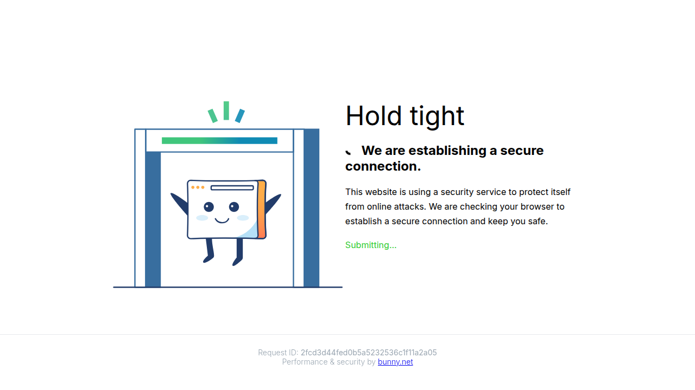

# Visited: https://xdaforums.com/t/how-to-make-miui-dual-apps-is-unlimited.4333697/
**Time:** Wed May 13 05:29:52 UTC 2026

## Screenshot

## Raw HTML
[page.html](./page.html)

## Downloaded Media (0 files)
_No media files downloaded_

## Other Links
- [/.bunny-shield/assets/challenge-styles.css](/.bunny-shield/assets/challenge-styles.css)
- [/.bunny-shield/assets/shield-challenge.js](/.bunny-shield/assets/shield-challenge.js)
- [https://bunny.net/](https://bunny.net/)
- [https://fonts.bunny.net/css?family=Inter:300,400,500,700](https://fonts.bunny.net/css?family=Inter:300,400,500,700)

## Stats
- Links: 5
- Media: 0
